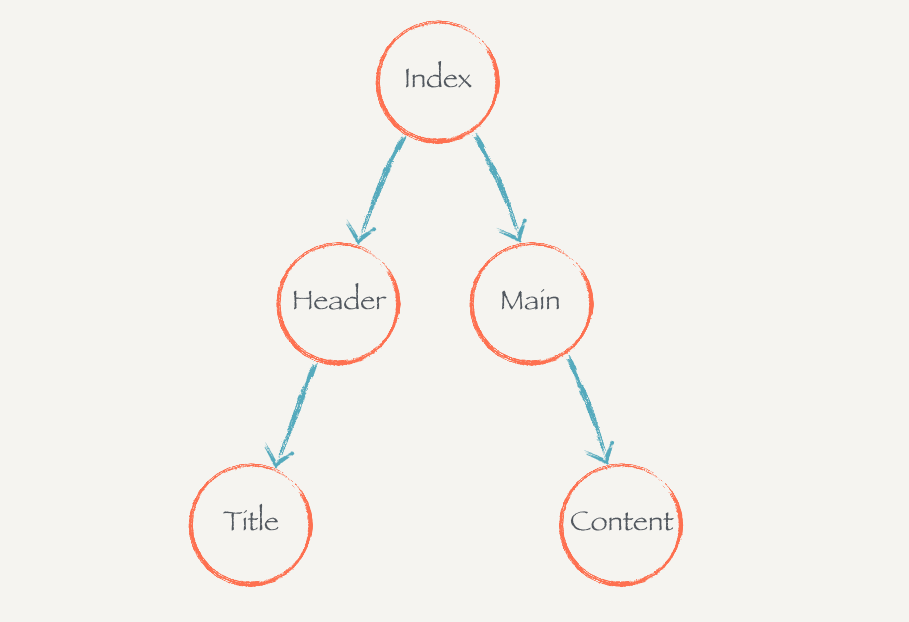
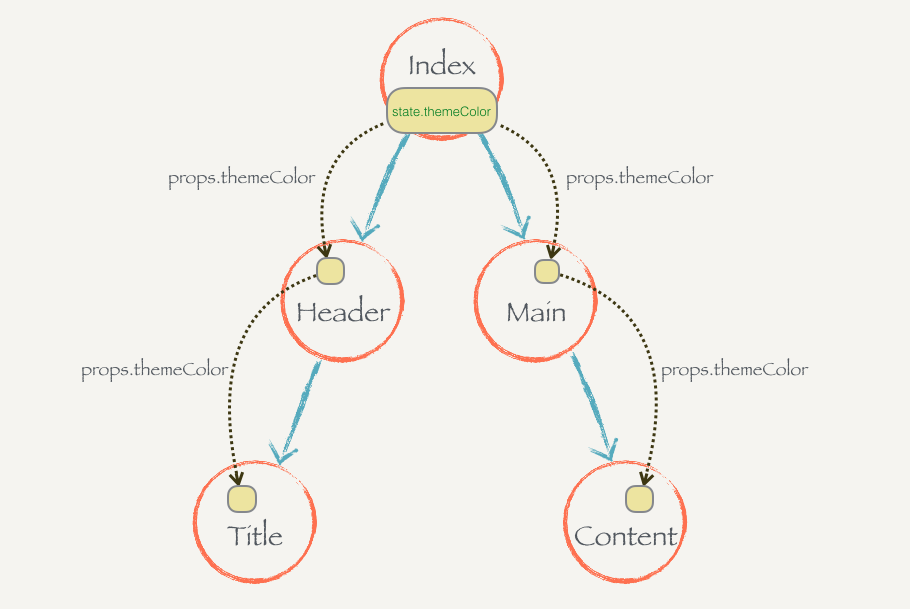
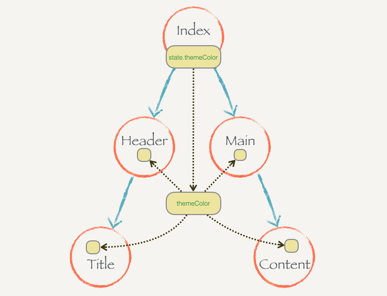

# 一个react-context的栗子

context 主要解决深层组件传递的问题

假设现在这个组件树代表的应用是用户可以自主换主题色的，每个子组件会根据主题色的不同调整自己的字体颜色或者背景颜色。

“主题色”这个玩意是所有组件共享的状态，需要把这个状态提升到根节点的 Index 上，然后把这个状态通过 props 一层层传递下去：

假设原来主题色是绿色，那么 Index 上保存的就是 this.state = { themeColor: 'green' }。如果要改变主题色，可以直接通过 this.setState({ themeColor: 'red' }) 来进行。这样整颗组件树就会重新渲染，子组件也就可以根据重新传进来的 props.themeColor 来调整自己的颜色。

但这里的问题也是非常明显的，我们需要把 themeColor 这个状态一层层手动地从组件树顶层往下传，每层都需要写 props.themeColor。如果我们的组件树很层次很深的话，这样维护起来简直是灾难。

如果这颗组件树能够全局共享这个状态就好了，我们要的时候就去取这个状态，不用手动地传：

就像这样，Index 把 state.themeColor 放到某个地方，这个地方是每个 Index 的子组件都可以访问到的。当某个子组件需要的时候就直接去那个地方拿就好了，而不需要一层层地通过 props 来获取。不管组件树的层次有多深，任何一个组件都可以直接到这个公共的地方提取 themeColor 状态。

React.js 的 context 就是这么一个东西，某个组件只要往自己的 context 里面放了某些状态，这个组件之下的所有子组件都直接访问这个状态而不需要通过中间组件的传递。一个组件的 context 只有它的子组件能够访问，它的父组件是不能访问到的，你可以理解每个组件的 context 就是瀑布的源头，只能往下流不能往上飞。

具体栗子请看：src/react-context-demo
